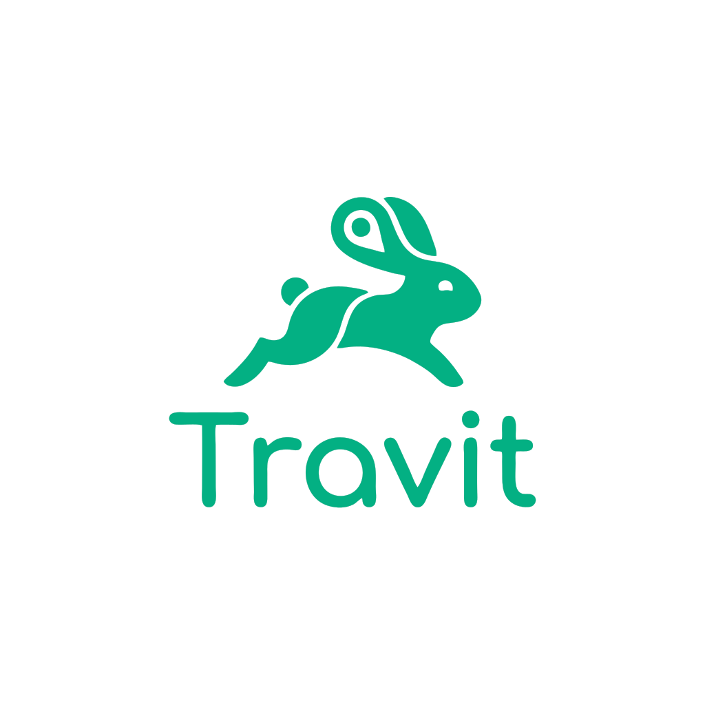
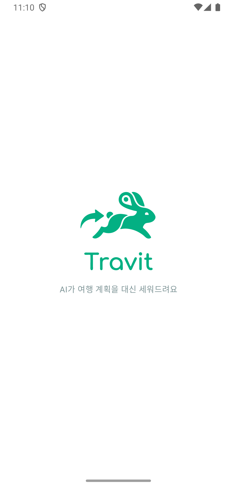
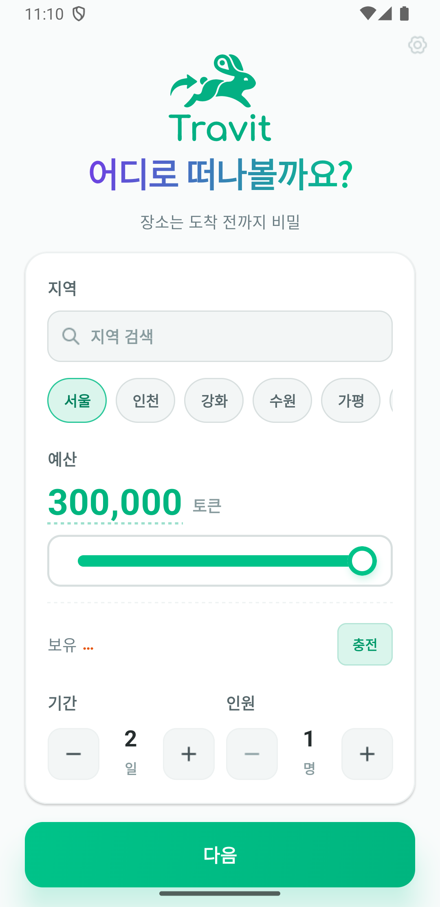
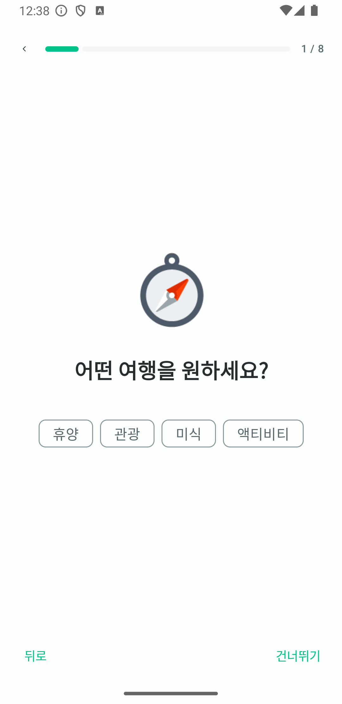
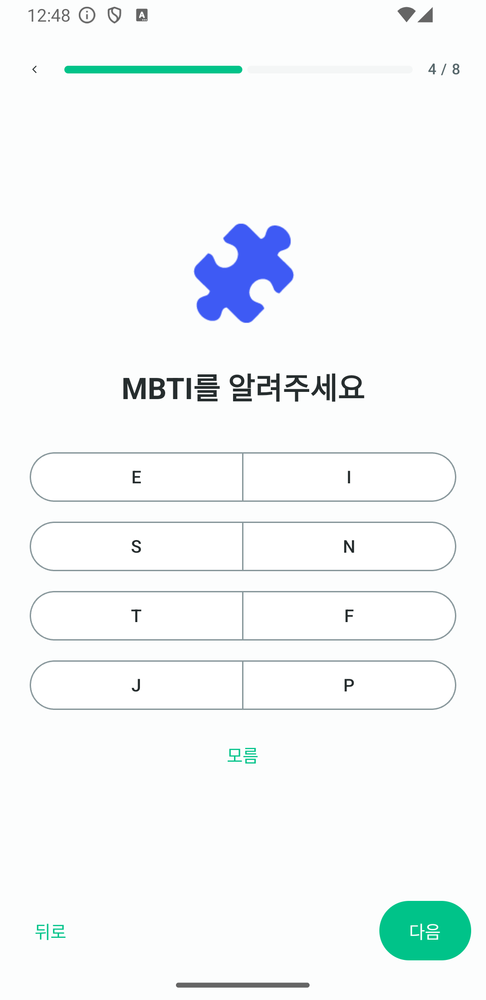
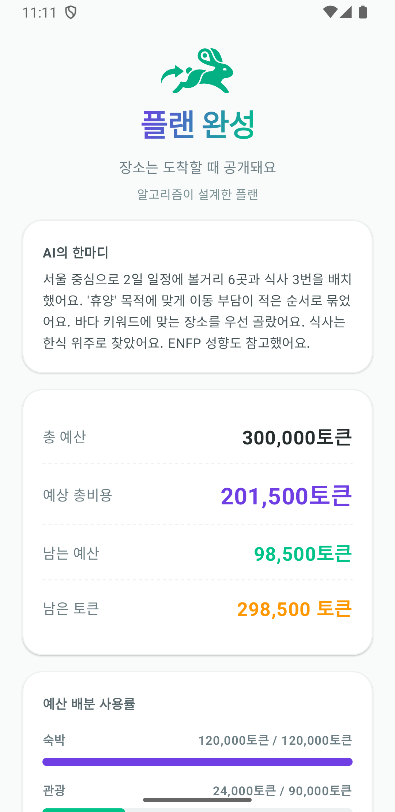
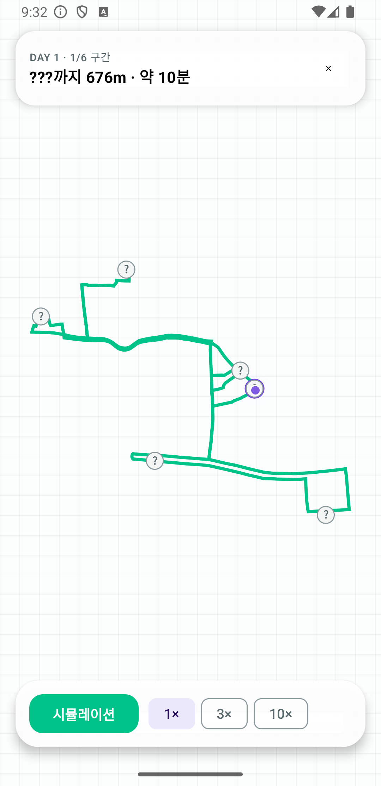
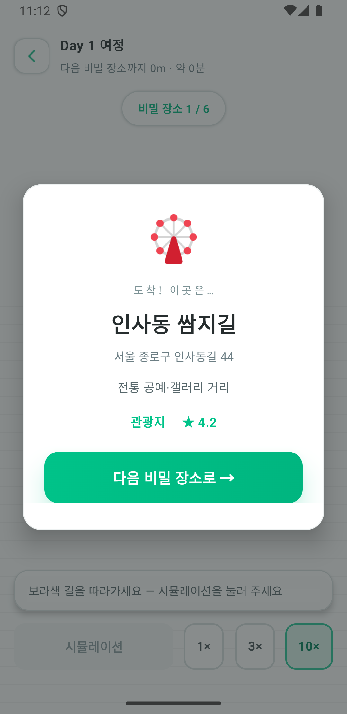
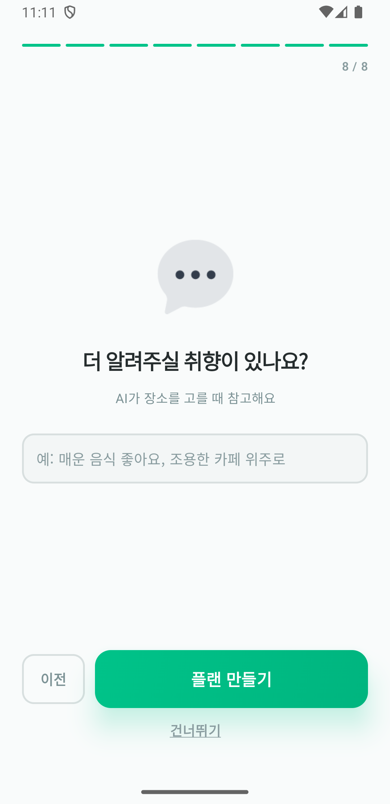
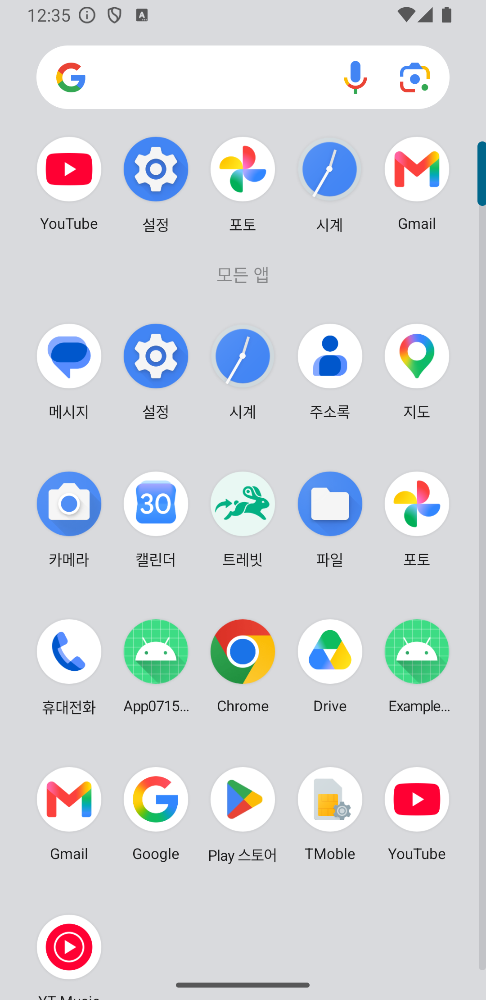

<div align="center">



# 트레빗 (Travit)

**Travel + Trip + Navigator — AI가 여행의 모든 결정을 대신하는 서프라이즈 여행 내비게이터**

제4회 NAVER OGQ마켓 AI Competition 출품작 · 팀 **PLAYLABS** (아산스마트팩토리마이스터고)
2026 충남권 고교-대학 창업아이디어 경진대회 **최우수상(2위)** 아이디어("따라와유")의 리브랜딩·실구현

[](LICENSE)

### 🔗 프로덕트 URL — http://112.166.208.166

데모 모드 지원 (GPS 불필요) · 서비스 지역: 수도권(서울·경기·인천)

</div>

---

## 1. 문제 정의

여행 앱들은 '더 많은 선택지'를 제공하지만, 사람들은 그 선택지 때문에 여행을 포기합니다.

- MZ세대 **72%가 결정 피로** 호소 (잡코리아, 2024)
- 1인 가구 **804만 (36.1%)** — 혼자 떠나기 좋은 자동화된 여행 상품 부재
- 자체 설문(50명): **"갈 데가 없어서가 아니라, 정하는 게 귀찮아서 안 간다"** 다수 응답

**트레빗의 역발상** — 결정을 도와주는 AI가 아니라 **결정을 대신 해버리는 AI**.
사용자는 예산과 취향만 알려줍니다. 일정·식당·숙소·동선은 딥러닝이 결정하고,
**개별 장소는 도착하는 순간까지 비공개**입니다. (지역은 사용자가 선택 — 수도권 21곳)

## 2. 앱 화면 (Android)

| 인트로 | 여행 설정 | 취향 질문 |
|:-:|:-:|:-:|
|  |  |  |

| MBTI 질문 | 결과 (AI 추천 이유) | 여정 (경로 안내) |
|:-:|:-:|:-:|
|  |  |  |

| 도착 공개 | 취향 메모 | 런처 아이콘 |
|:-:|:-:|:-:|
|  |  |  |

## 3. 핵심 사용자 경험

```
인트로 → 지역·예산·기간·인원 설정
  → 취향 질문 8개 (한 화면에 하나씩: 목적·성별·연령·MBTI·음식·장소·걷기·취향 메모)
  → LLM이 여행 계획 수립 (+ 추천 이유 제시)
  → 비공개 플랜 (장소는 유형·시각·비용만 공개)
  → 발밑 130m씩만 공개되는 길 따라가기
  → 도착 반경 20m에서만 장소 공개
```

- **질문형 온보딩**: 취향을 한 번에 몰아 묻지 않고 한 화면에 하나씩 — 이모지가 중앙에 오고 질문·선택지가 아래에 놓인다. 단일 선택은 고르면 바로 다음 질문으로 넘어간다
- **프로필 기반 AI 계획**: 예: "10대 INFP, 휴양 목적, 한식, 걷기 싫어함" → 산·트레킹 배제, 이동 최소화, 한식당 우선
- **자연어 취향 메모**: "매운 음식 좋아요, 조용한 카페 위주로" — LLM 프롬프트에 직접 반영
- **미스터리 내비게이션**: 지도 잠금 + 경로 부분 공개 + 도착 시 리빌
- **대중교통 통합**: 승하차 정류장 안내, 실시간 버스 도착정보, 하차 카운트다운
- **데모 모드**: GPS 없이 경로 자동 이동(배속 조절) — 심사·시연용

## 4. 아키텍처

```
┌ 클라이언트 ────────────────────────────────────────────┐
│  웹 데모 (Vanilla JS + Leaflet/OSM) — 심사위원 체험용      │
│  Android 앱 (Jetpack Compose / Kotlin Multiplatform)    │
│    └ shared: DTO · Ktor 클라이언트 · 도메인 (iOS 공유 가능)  │
└──────────────────────┬─────────────────────────────────┘
                       │ REST (JSON)
┌ 백엔드: Kotlin + Spring Boot 3 (단일 jar, 웹 데모 정적 서빙) ┐
│  AiPlanService    LLM(LM Studio·OpenAI 호환) 일정 설계      │
│                   — 프로필·취향 프롬프트, 실패 시 휴리스틱 폴백  │
│  PlanService      예산 배분 → 스코어링 → 동선 최적화          │
│  RegionService    수도권 지역명 → 좌표 (서울·경기·인천 21곳)   │
│  PlaceProvider    TMAP POI ⇄ 키 없으면 수도권 시드 폴백       │
│  RouteService     OSRM 보행 + TMAP/ODsay 대중교통           │
│  PublicBusService 국토부 TAGO 실시간 버스                   │
│  Wallet           토큰 선결제 시뮬레이션 (H2 + JPA)          │
└────────────────────────────────────────────────────────┘
```

**폴백 설계 원칙**: 외부 API 키가 하나도 없어도 전체 플로우가 동작합니다.
(TMAP → 수도권 시드 / LLM → 휴리스틱 / 대중교통 → 도보·직선 경로)

## 5. 사용 스택

| 구분 | 기술 |
|---|---|
| 백엔드 | Kotlin 2.x · Spring Boot 3.5 · JPA · H2 · Gradle(Kotlin DSL) |
| 앱 | Kotlin Multiplatform · Jetpack Compose(Material3) · Ktor · kotlinx.serialization |
| 웹 데모 | Vanilla JS · Leaflet 1.9 + OpenStreetMap |
| AI | LM Studio 로컬 LLM (google/gemma-4-26b-a4b-qat, OpenAI 호환 API) + 휴리스틱 추천·동선 알고리즘 |
| 디자인 | OGQ 디자인 토큰 · 토스페이스 이모지 폰트 · 디자인 시스템 아이콘 |
| 외부 API | SK open API(TMAP) · 국토부 TAGO · ODsay · OSRM |
| 배포 | Docker 멀티스테이지 · Render |

## 6. 실행 방법

### 백엔드 + 웹 데모 (단일 jar)

```bash
cd code/backend
./gradlew bootRun          # http://localhost:8080
```

API 키 없이 바로 실행됩니다(수도권 시드 데이터 모드). 실 데이터·로컬 AI 연동은 `code/.env.example` 참고.

### Android 앱

앱은 위 백엔드에 붙어 동작하므로 **백엔드를 먼저 띄워 주세요.**

```bash
cd code/app-kmp
./gradlew :composeApp:assembleDebug
# APK: composeApp/build/outputs/apk/debug/composeApp-debug.apk
```

> JDK 21이 필요합니다(`gradle.properties`의 `org.gradle.java.home`에 고정). JDK 26에서는 AGP가 아직 동작하지 않습니다.

**한 번에 실행** — 백엔드·에뮬레이터를 확인해 꺼져 있으면 띄우고, APK를 설치·실행합니다.

```bash
cd code
./run-app.sh              # APK가 있으면 그대로 설치·실행
./run-app.sh --build      # 코드를 고쳤을 때
./run-app.sh --device     # USB로 연결한 실제 폰에 설치
```

에뮬레이터는 기본 서버 주소가 `http://10.0.2.2:8080`(에뮬레이터에서 본 호스트)이라 설정 없이 바로 붙습니다.

**실제 기기에서 실행** — APK를 폰으로 옮겨 설치한 뒤(출처를 알 수 없는 앱 설치 허용 필요),
폰과 PC를 **같은 Wi-Fi**에 두고 앱 홈 화면 우상단 **설정(⚙)** 에서 서버 주소를 PC의 LAN IP로 바꿉니다.

```
http://<PC의 LAN IP>:8080      # 예: http://192.168.0.10:8080
# macOS에서 IP 확인: ipconfig getifaddr en0
```

배포된 서버가 있다면 그 주소(`https://...`)를 넣어도 됩니다. 이 경우 PC를 켜둘 필요가 없습니다.

### Docker

```bash
cd code
docker build -f backend/Dockerfile -t trevit . && docker run -p 8080:8080 trevit
```

## 7. AI 사용 내역 (전면 공개)

### 프로덕트에 들어간 AI
- **LLM 여행 계획 수립**: LM Studio(OpenAI 호환)의 `google/gemma-4-26b-a4b-qat` — 사용자 프로필(성별·연령·MBTI·목적·음식·자연어 취향 메모)을 프롬프트로 받아 장소 선택·일정 구성·추천 이유 생성. 타임아웃·실패 시 휴리스틱 자동 폴백
- **자체 알고리즘**: 예산 제약 스코어링(평점·근접도·비용) + 최근접 이웃 동선 최적화 + 취향 필터(걷기 기피 → 산 배제 등)

### 개발 과정에서 사용한 AI
- **Claude (Anthropic)** — Claude Code로 Java→Kotlin 포팅, Compose 앱 개발, 데모 모드, 문서화 지원. 기획·아이디어·검증은 팀 수행

### 오픈소스 / 외부 자문
- Spring Boot, Leaflet, OSRM, Compose Multiplatform, Ktor, 토스페이스(토스) 등
- 지도교사 김영우 · 충남권 창업아이디어 경진대회 멘토링

## 8. 팀 — PLAYLABS

| 역할 | 이름 | 담당 |
|---|---|---|
| 대표 | 김태훈 (3학년) | 기획 총괄 · AI · 백엔드 |
| 팀원 | 장한결 (3학년) | 데이터 · 서버 |
| 팀원 | 이승주 (3학년) | UI/UX |
| 팀원 | 이윤호 (1학년) | QA · 테스트 |

## 9. 라이선스

[Apache License 2.0](LICENSE)
