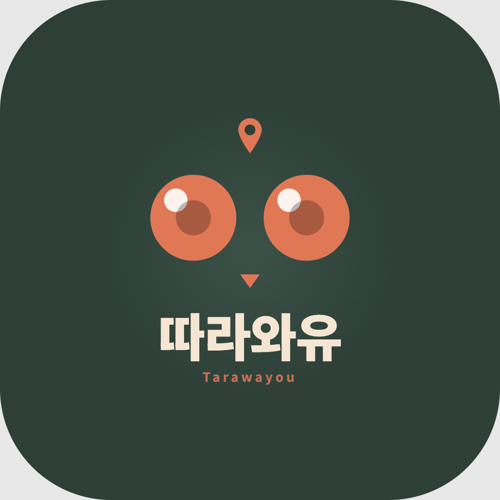
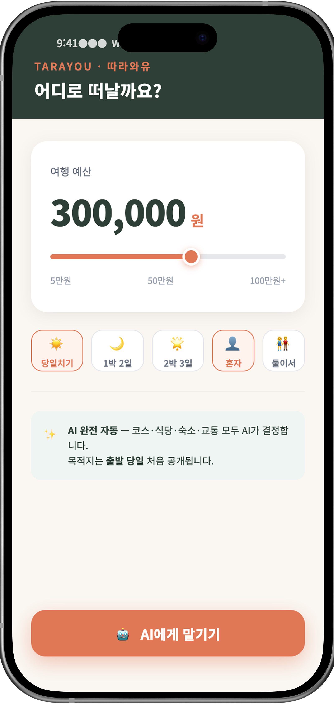
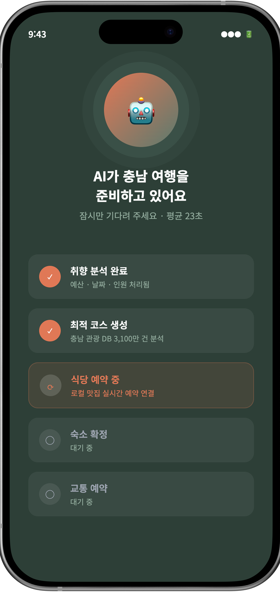
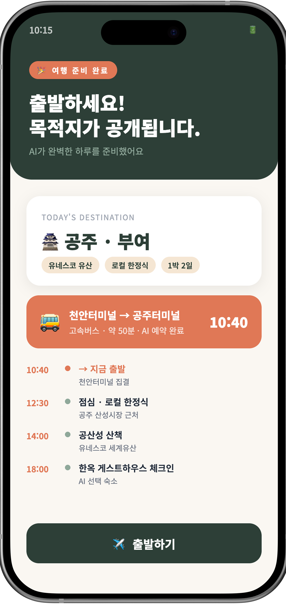
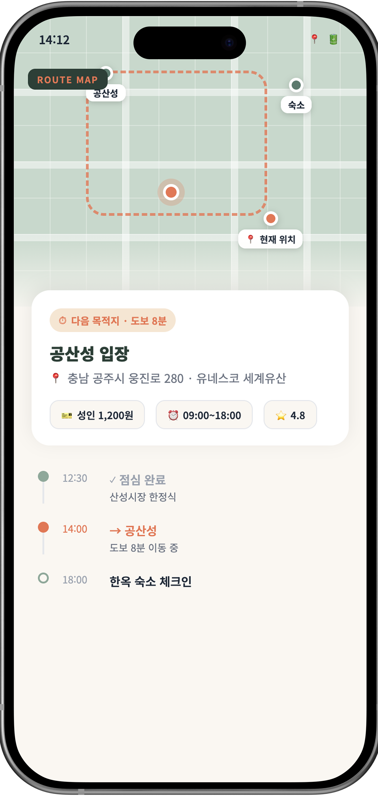
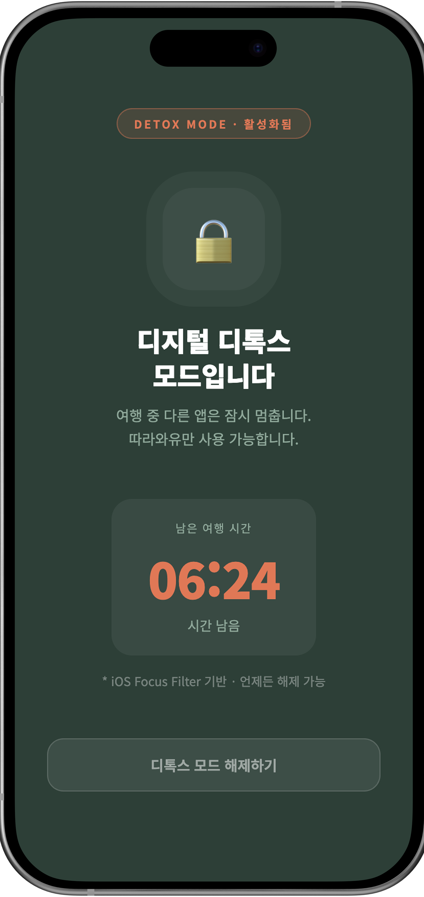

<div align="center">



# 따라와유 (Tarawayou)

**AI 완전자동 서프라이즈 충남 여행 앱**

> _"예산만 넣으면, AI가 충남 여행을 완전 자동으로 처리합니다."_

🏆 **2026 충남권 고교-대학 창업아이디어 경진대회** 본선 **2위 (최우수상)** 수상

</div>

---

## 📖 프로젝트 개요

따라와유는 **사용자가 결정하지 않는 여행 앱**입니다.
코스·식당·숙소·교통·예약까지 모든 의사결정을 AI가 대신 내려주고,
사용자는 그저 따라가기만 하면 되는 **서프라이즈 디지털 디톡스 여행 플랫폼**입니다.

### 🎯 해결하려는 문제

세상의 모든 여행 앱은 **'더 많은 선택지'** 를 제공합니다. 그런데 사람들은 그 선택지 때문에 여행을 포기합니다.

> **"갈 데가 없어서가 아니라, 정하기가 귀찮아서 안 간다."**

- 🏠 한국 1인 가구 **804만 명** (전체의 36.1%) — 1인 특화 여행 패키지는 거의 0개
- 😩 MZ세대 결정 피로 호소 **72%** — 여행 계획 평균 14시간 후 결국 포기
- 🌊 충남 1인 여행객의 **90%** 는 충남이 아니라 수도권·부산·제주 선택

---

## 🚀 5단계 사용 흐름

```
1. 예산 입력         →  슬라이더로 5~100만원, 한 번에 결제
2. AI 자동 예약      →  코스·식당·숙소·교통 모두 1분 안에 자동
3. 서프라이즈 공개   →  목적지는 출발 당일 첫 공개 (충남 어딘가)
4. 실시간 동선 안내  →  지도·알림·타이머로 다음 장소만 안내
5. 디지털 디톡스 ON  →  여행 중 SNS·업무앱 자동 차단
```

**예산 입력 → AI에게 맡기기.** 두 번의 탭으로 끝납니다.

---

## 📱 앱 화면

| ① 예산 입력 | ② AI 처리 | ③ 서프라이즈 | ④ 동선 안내 | ⑤ 디톡스 |
|:---:|:---:|:---:|:---:|:---:|
|  |  |  |  |  |

---

## 🛠️ 기술 스택

### AI Recommendation Engine — 하이브리드 4-모듈

| 모듈 | 기술 | 역할 |
|------|------|------|
| 자연어 이해 | **LangChain + GPT-4** | 예산·취향을 자연어로 받아 코스 생성 |
| 협업 필터링 | **ALS + TF-IDF** | 유사 여행자 패턴 학습 |
| 예산 최적화 | **XGBoost** | 만족도 최대 조합 예측 (컨텍스트 부스팅) |
| 경로 최소화 | **OR-Tools TSP** | 동선 자동 최적화 및 지역 균형 분배 |

### 데이터 파이프라인 — 공공 API 6종 융합

- **TourAPI 4.0** (한국관광공사)
- **충남 알담** (alldam.chungnam.go.kr)
- **기상청** 단기예보 API
- **국가대중교통정보** API
- **소상공인시장진흥공단** API
- 자체 행동 로그 (예산·만족도·체류시간)

### 인프라

- **Frontend**: React Native (iOS/Android)
- **Backend**: FastAPI · PostgreSQL · Redis
- **Deploy**: AWS Lambda 서버리스

---

## 💰 시장성 & 비즈니스 모델

### 시장 규모 (탐샘솜)

| 단계 | 규모 | 근거 |
|:-:|:-:|---|
| **TAM** | ₩36.8조 | 국내 여행 총 시장 (한국관광공사 2024) |
| **SAM** | ₩5조 | 1인 여행 + 디지털 디톡스 세그먼트 |
| **SOM** | ₩1,500억 | 3년 내 충남·충청권 도달 목표 |
| **연매출 (3년차)** | **약 200억** | 수수료 12% + 보조 수익원 |

### 5가지 수익 구조

| # | 수익원 | 3년차 비중 |
|:-:|---|:-:|
| ① | 예약 수수료 12% | **70%** (주력) |
| ② | 프리미엄 구독 ₩9,900/월 | 7% |
| ③ | B2G 데이터 (지자체·관광공사) | 5% |
| ④ | 지역 인증 광고 | 8% |
| ⑤ | B2B 단체 (학교·기업 워크샵) | 10% |

---

## 🛡️ 차별성 & 방어선 (Moat)

| | 일반 여행 앱 | 따라와유 |
|---|---|---|
| 결정 주체 | 사용자 직접 | **AI 100% 자동** |
| 목적지 공개 | 예약 시 | **출발 당일 첫 공개** |
| 결제 방식 | 항목별 | **예산 선결제 일괄** |
| 앱 사용 | 자유 | **디지털 디톡스 옵트인** |
| 지역 연계 | 전국 광역 | **충남 소상공인 직거래** |

야놀자·트리플·에어비앤비 같은 대기업이 따라 할 수 없는 이유:

> 그들의 BM은 **'선택지 = 매출'**, **'사용 시간 = 매출'** 인데,
> 따라와유는 정반대로 **'결정 빼앗기'**, **'사용 시간 줄이기'** 가 핵심 가치입니다.
> 따라 하는 순간 자기 본업이 카니발리제이션됩니다.

---

## 👥 팀 · Kims & Lee

**아산스마트팩토리마이스터고등학교**

| 역할 | 이름 | 학년 | 담당 |
|---|---|:-:|---|
| 팀장 | **김태훈** | 3 | 프로젝트 총괄 · AI 모델링 · 사업 기획 · 발표 |
| 팀원 | **김재원** | 3 | 데이터 분석 · 백엔드 · 공공 API 통합 |
| 팀원 | **김준서** | 3 | UI/UX 디자인 · Figma 프로토타이핑 · 운영 |
| 팀원 | **이윤호** | 1 | QA · 테스트 · 사용성 검증 |
| 지도교사 | 김영우 | — | 전체 지도 |

**협력 기관**: 충남교육청 · 선문대 SW중심대학사업단

---

## 📁 저장소 구조

```
📁 인공지능_여행앱_따라와유_프로젝트/
├── 📄 따라와유_아이디어_총정리.md          ← PSST · 탐샘솜 · Who/What/How 종합 문서
└── 📁 선문대_창업아이디어_경진대회/
    ├── 📄 CLAUDE.md                          ← PPT 디자인 규칙 (편집 가이드)
    │
    ├── 🎤 [발표 자료]
    │   ├── 따라와유_본선_발표.pptx           ← 최종 발표 PPT (13 슬라이드)
    │   ├── 따라와유_본선_발표.pdf
    │   └── 발표_스크립트.md
    │
    ├── 🖼️ [포스터]
    │   ├── 본선 포스터_아산스마트팩토리마이스터고등학교_김태훈.pptx
    │   ├── 따라와유_본선_포스터_A3.pptx / .pdf
    │   └── poster-1.jpg
    │
    ├── 📱 [앱 화면 목업]
    │   └── app_screens/
    │       ├── icon.html / icon.png          ← 앱 아이콘
    │       ├── splash.html / splash.png      ← 스플래시 화면
    │       ├── index.html                    ← 5화면 통합 HTML
    │       ├── mockup_phone1~5.png           ← 아이폰 목업 5장
    │       ├── screen1~5.png                 ← 개별 화면 캡처
    │       └── screenshot.js                 ← Puppeteer 자동 캡처
    │
    ├── ⚙️ [자동 생성 빌더]
    │   ├── build_ppt.js                      ← pptxgenjs 기반 PPT 빌더
    │   ├── build_poster.js
    │   ├── build_poster_template.py          ← python-pptx 기반 포스터 빌더
    │   ├── capture_icon.js                   ← 아이콘 캡처 (Puppeteer)
    │   └── capture_splash.js                 ← 스플래시 캡처
    │
    └── 🏛️ [대회 자료]
        ├── 창업아이디어 경진대회 신청서.hwp
        ├── 2026년 충남권 고교-대학 창업아이디어 경진대회 안내.pdf
        ├── 멘토링_내용.pdf                    ← 창업전문가 멘토링 전사
        └── 신청서에_대한_대회본부_자문.png
```

---

## 🎨 자동 생성 도구 사용법

### PPT 생성

```bash
cd 선문대_창업아이디어_경진대회
node build_ppt.js
# → 따라와유_본선_발표.pptx 생성
```

> ⚠️ **주의**: `build_ppt.js` 실행 시 수동 편집 내용이 모두 사라집니다.
> 최종 PPT는 PowerPoint MCP 또는 python-pptx로 직접 편집하세요. (`CLAUDE.md` 참조)

### 앱 아이콘 · 스플래시 캡처

```bash
node capture_icon.js    # icon.html → icon.png (1024×1024)
node capture_splash.js  # splash.html → splash.png
```

### 5화면 목업 캡처

```bash
cd app_screens
node screenshot.js
# → screen1~5.png 생성
```

---

## 📊 검증 데이터

- ✅ **자체 파일럿 인터뷰 50명** — 68%가 "이용해보겠다" 응답
- ✅ **교사 10명 중 4명** — 학교 단체 도입 검토 의향
- ✅ **GPT 프롬프트 MVP** 동작 검증 완료 (라이브 시연 가능)
- ✅ **Figma UI/UX 5화면** 프로토타이핑 완료

---

## 📚 참고 데이터 출처

| 데이터 | 출처 |
|---|---|
| 1인 가구 통계 (36.1% / 804만) | 통계청 '2024 통계로 보는 1인가구' |
| 국내 여행 시장 (36.8조) | 한국관광공사 국민여행조사 2024 |
| 충남 관광객 (3,100만, +17%) | 관광지식정보시스템 2023 |
| 디지털 디톡스 관광 시장 | Polaris Market Research 2025 |
| MZ 결정 피로 (72%) · 번아웃 (70%) | 잡코리아 2024 |
| 일일 스마트폰 사용 (5h 14m) | 와이즈앱 2024 |
| SNS 차단 여행 수요 (24%) | Hilton Trend Report 2025 |

---

## 📌 한 줄로

> **"우리는 여행을 팔지 않습니다. 우리는 '결정 부담 없는 휴식'을 팝니다."**
>
> **따라가기만 하세요. 나머지는 AI가 합니다.**

---

<div align="center">

**Kims & Lee Team** · 아산스마트팩토리마이스터고등학교 · 2026

</div>
